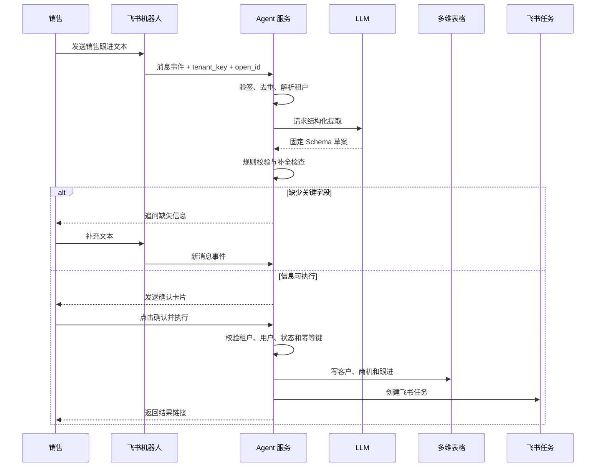
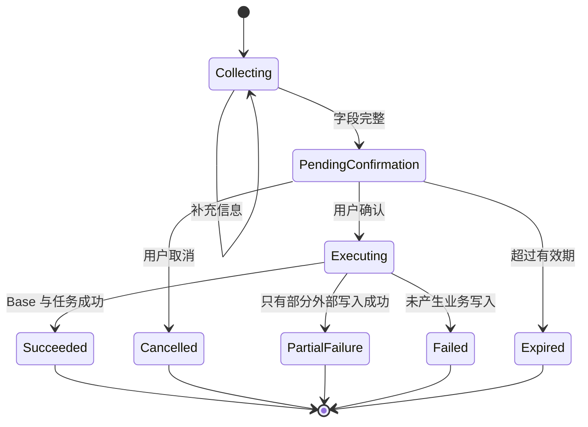

# Agent 交互与能力

> 本文第 1–7 节是**历史 P0 验收基线**，其中“无独立 Web 页面”“只可确认/取消”、
> “回复新文本重新解析”等不代表 Goal v3 的目标体验。后续机器人输入必须在原飞书聊天
> 的卡片内编辑、再质检、一次确认跟进与预览的本人待办；详见第 8 节与
> [决策问答](decisions/2026-09-20-followup-chat-cards.md)。
> 对话入口与保存前可用性反馈按
> [新决策](decisions/2026-09-20-conversation-and-quality.md) 执行；以下旧 P0 示例和评分卡
> 仅保留历史验收证据，不代表最新体验。

## 1. P0 是否需要页面

不需要独立 Web 页面。

P0 的完整用户界面只有两类：

| 入口 | 用途 |
| --- | --- |
| 飞书机器人私聊 | 提交销售跟进、补充信息、查看执行结果 |
| 飞书消息卡片 | 确认或取消结构化结果及任务草案 |

飞书多维表格承担数据查看和人工校验，不作为销售人员必须操作的产品页面。未来只有在批量管理、
租户配置或经营分析确有需要时，才增加独立管理页面。

## 2. P0 用户故事

销售完成一次客户沟通后，直接给机器人发送：

```text
刚和北辰精密的顾总开完会。他认可我们的方案，但要求补一份三年 TCO。
我周四前发给他，预计项目金额 80 万。
```

Agent 返回确认卡片：

```text
客户：北辰精密
联系人：顾总
商机进展：方案已获得初步认可
客户要求：补充三年 TCO
下一步：提交三年 TCO
负责人：当前用户
截止时间：本周四
预计金额：800,000 元

[确认并执行] [取消]
```

用户确认后，Agent：

1. 在客户表中匹配或创建“北辰精密”。
2. 在商机表中匹配或创建对应商机，并更新金额、进展和下一步。
3. 新增一条保留原始文本的跟进记录。
4. 创建“提交三年 TCO”飞书任务。
5. 返回包含 Base 记录和飞书任务链接的成功卡片。

## 3. 交互原则

- 用户可以直接说自然语言，不需要记命令。
- Agent 缺少客户、下一步或截止时间时先追问，不生成不可执行任务。
- LLM 输出只是待确认草案，不能直接写 Base 或创建任务。
- P0 卡片只提供“确认并执行”和“取消”，纠正内容通过回复新文本重新解析。
- 同一张卡片只能成功执行一次；重复点击返回已处理状态，不重复创建记录或任务。
- 所有回复都必须进入成功、取消、失败、无权限或已处理终态，不能长期显示“处理中”。

## 4. Agent 能力边界

### P0 实现

- 接收飞书机器人私聊文本。
- 从文本中提取客户、联系人、需求、进展、风险、金额、下一步和截止时间。
- 将模型输出校验为固定 JSON Schema。
- 对缺失字段发起一轮或多轮追问。
- 发送结构化确认卡片。
- 确认后调用客户、商机、跟进三个 Base 工具。
- 确认后创建真实飞书任务。
- 返回成功结果或可解释失败。
- 对事件、卡片点击和外部写入进行幂等处理。
- 按 `tenant_id` 隔离会话、配置和工具调用。

### P0 不实现

- 群聊提及和群历史读取。
- 语音、图片、文件和会议纪要解析。
- 独立 Web 页面。
- CRM 或企业数据库接入。
- 经营预测、团队管理和 Playbook。
- 飞书任务完成状态回收。
- 自动向客户或群聊发送消息。
- 飞书应用市场发布、计费和自助开通。

## 5. 主业务流



## 6. 确认状态机



`PartialFailure` 必须记录哪些记录已经创建，并提供安全重试。重试只能补做失败步骤，不能重复
创建已经成功的客户、商机、跟进或任务。

## 7. 最低验收

1. 测试用户能在飞书中找到并私聊“销售agent”。
2. 用户发送示例跟进后收到字段正确的确认卡片。
3. 取消卡片不会写 Base，也不会创建任务。
4. 确认卡片后，客户、商机和跟进出现在正确的 Demo Base 表中。
5. 飞书任务出现在当前用户的任务列表中，负责人和截止时间正确。
6. 重复投递同一个消息事件或重复点击卡片不会产生重复数据。
7. 任意失败都有可见终态，并能从审计记录定位原因。
8. 两个模拟租户不能读取或使用对方的 Base 配置、会话和幂等记录。

## 8. Goal v3 新目标（2026-09-20 决策）

机器人提交的文本、语音、妙记或飞书文档链接，反馈和确认均在**提交的原聊天**完成。
Web 有表单/复杂详情，但不能成为机器人输入的强制确认页。

```text
同一聊天：草案＋保存前可用性检查＋待办预览卡
-> 销售补充/检查修改（更新同一张卡）
-> 一次确认最终跟进与所示本人待办
-> 先写 Base 跟进，再自动创建飞书任务
-> 原卡就地更新：唯一执行结果＋已创建任务卡
-> 新可行动项目风险/关键变化/主动分析：条件性项目推进质检卡
```

普通跟进使用一个持续更新的主卡消息；只有命中条件风险时才新增风险卡。未知联系人、方式、
下一步要逐项提示，销售可以明确
“暂无下一步＋原因”保存真实记录但不创建任务；客户或有效沟通正文缺失时不允许确认。
跨角色风险通知、定时报告和任务提醒各自独立触发，并检查证据、权限与租户策略。
Goal v3 的文本草案卡、版本化再质检和任务预览一次确认已完成代码、自动化与历史真实飞书
UI 验收；现行成功结果由原草案卡就地更新并保持唯一，仍需真实飞书复测。条件项目风险卡已完成代码和
自动化，但仍需使用带明确风险证据的样本做第三卡 UI 验收。风险卡只在命中新可行动证据时
出现，且样本不足时不生成健康度数字。语音、妙记/会议和文档来源仍未实现。

## 9. 对话先行与质量反馈修订

机器人私聊消息先由 LLM 结合同聊天短期上下文分辨问候、销售方法问答、内容生成、业务查询、
跟进记录、任务/商机操作、项目诊断和歧义。普通聊天直接回答，不产生跟进卡；销售仅陈述客户
事实时先澄清记录还是分析。只有模型分类为跟进且通过当前状态、安全门后才调用抽取器；首切片未接通的业务查询
不编造结果，复杂通用多轮上下文、RAG 和独立任务/商机写操作后续交付。

跟进卡主视觉改为“我理解的事实 + 可以保存/需要确认 + 建议补充 + 待办预览”；
旧质量数字/等级保留为后台兼容快照，默认卡不再将销售本次沟通评成 73/B。保存后项目
诊断与销售主动请求的辅导分别使用其自身证据，不与单条记录完整度混淆。原聊天两卡及
条件第三卡、精确版本和一次确认边界不变。

## 10. 当前意图与记忆实现口径

当前机器人不是“看到关键词就打开跟进表单”。消息先经过 LLM 意图分类器，分类器会看到当前
消息、同一租户/销售/聊天的最近短期对话和当前活跃工作流；模型只返回受 Schema 约束的意图
建议，不能自行写入业务数据。

代码随后执行确定性的安全职责：校验租户与操作者、承接或关闭澄清会话、提取已分类跟进的正文、
展示确认卡、处理幂等和执行权限。`写跟进` 这类显式文本解析只用于识别“命令本身是否带正文”，
不能绕过 LLM 意图分类，也不能直接触发 Base/Task。

短期记忆的目标实现迁移为 LangGraph Postgres Checkpointer，按租户、销售和聊天隔离，保存
thread 状态、暂停/恢复点和有限上下文；助手的澄清和最终答复也会进入 Graph 状态。长期语义
记忆选用 Mem0 OSS，但只保存经过策略批准的用户/销售偏好；长期业务事实仍以销售确认后写入的
Base/Task 为准。迁移完成前，旧 `conversation_turns` 仅作为历史实现和回放对账来源，禁止与
新路径长期双写。
