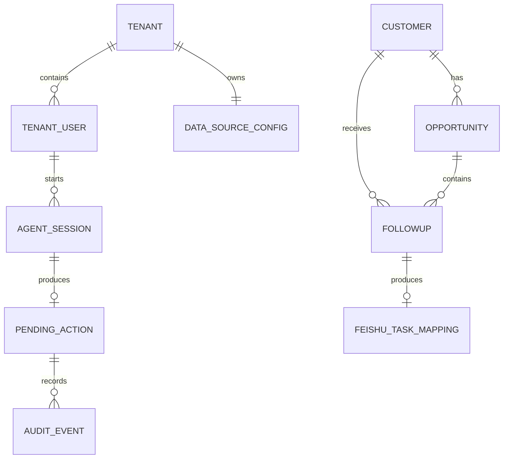
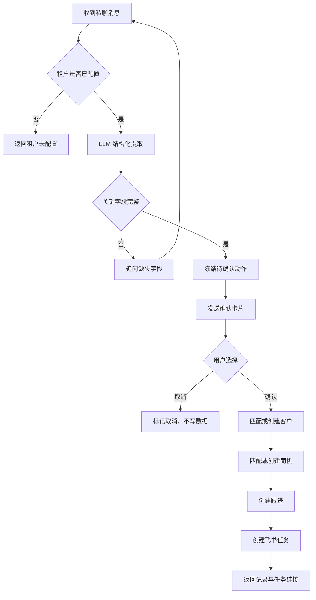
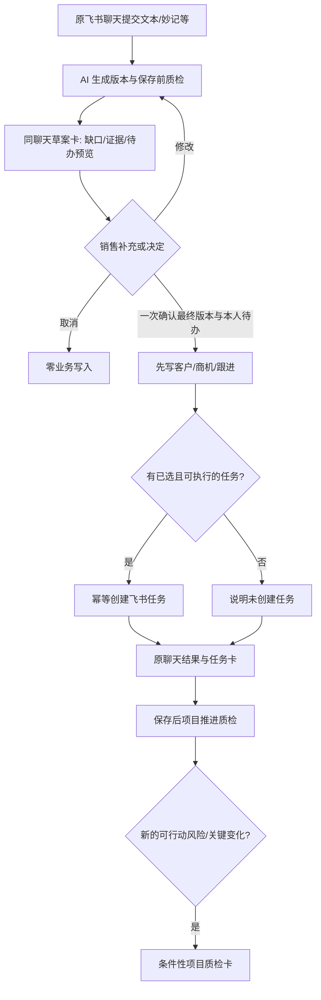

# 业务架构

> 第 1–6 节记录 P0 已验证流程；Goal v3 的最新顺序、条件卡片和一次确认任务授权见
> 第 7 节与 [决策问答](decisions/2026-09-20-followup-chat-cards.md)。保留旧流程供回归，
> 不把它当作新版聊天卡片的完成证据。
> 普通聊天与跟进的前置意图分流、质量反馈新口径见
> [对话与质检决策](decisions/2026-09-20-conversation-and-quality.md)。

## 1. P0 业务对象



| 对象 | 定义 | P0 存储位置 |
| --- | --- | --- |
| 租户 | 一个飞书企业安装实例 | Agent 数据库 |
| 租户用户 | 当前企业中的飞书用户 | Agent 数据库最小映射 |
| 数据源配置 | 租户对应的 Base、表和字段映射 | Agent 数据库 |
| Agent 会话 | 多轮补全所需的短期上下文 | Agent 数据库 |
| 待确认动作 | 卡片展示的不可变业务草案 | Agent 数据库 |
| 客户 | 被销售推进的企业客户 | 多维表格 |
| 商机 | 围绕客户的一次销售机会 | 多维表格 |
| 跟进 | 一次沟通的原文、事实和下一步 | 多维表格 |
| 飞书任务映射 | 跟进与真实任务的对应关系 | Agent 数据库 |
| 审计事件 | 模型、确认、工具调用和终态记录 | Agent 数据库 |

## 2. Demo Base

P0 创建一个名为“销售 Agent Demo 数据”的多维表格，包含三个表。

### 客户

| 字段 | 类型 | 用途 |
| --- | --- | --- |
| 客户名称 | 文本，主字段 | 客户匹配键 |
| 行业 | 单选 | 模拟客户画像 |
| 规模 | 单选 | 模拟客户画像 |
| 联系人 | 文本 | 关键联系人 |
| 客户负责人 | 人员 | 当前销售 |
| 最近跟进时间 | 日期时间 | 判断活跃度 |
| 数据状态 | 单选 | 正常或演示 |

### 商机

| 字段 | 类型 | 用途 |
| --- | --- | --- |
| 商机名称 | 文本，主字段 | 默认“客户名 + 项目” |
| 客户 | 关联客户表 | 商机归属 |
| 阶段 | 单选 | 需求发现、方案验证、方案提交、商务谈判、赢单、输单 |
| 预计金额 | 数字 | 商机规模 |
| 商机负责人 | 人员 | 当前销售 |
| 当前进展 | 多行文本 | 已确认事实摘要 |
| 下一步 | 多行文本 | 待执行动作 |
| 下一步截止时间 | 日期时间 | 创建任务依据 |
| 风险 | 多行文本 | 已确认或待验证风险 |
| 最近跟进时间 | 日期时间 | 最后活动时间 |

### 跟进

| 字段 | 类型 | 用途 |
| --- | --- | --- |
| 跟进标题 | 文本，主字段 | 客户名 + 日期 |
| 客户 | 关联客户表 | 客户关系 |
| 商机 | 关联商机表 | 商机关系 |
| 原始文本 | 多行文本 | 审计证据 |
| 沟通摘要 | 多行文本 | 用户确认后的摘要 |
| 客户需求 | 多行文本 | 明确需求 |
| 异议与风险 | 多行文本 | 异议和风险 |
| 下一步 | 多行文本 | 计划动作 |
| 截止时间 | 日期时间 | 任务期限 |
| 跟进人 | 人员 | 消息发送者 |
| 确认状态 | 单选 | 已确认、已取消 |
| 消息 ID | 文本 | 消息级幂等与追溯 |

实际创建前必须根据 Base 返回的真实字段和表 ID 建立配置，代码不得猜测 ID。

## 3. 主业务流程



## 4. 匹配与写入规则

### 客户匹配

- P0 使用规范化后的客户名称精确匹配。
- 同名多条时不自动选择，返回冲突并要求人工处理。
- 没有匹配项时，确认动作中明确显示“将创建新客户”。

### 商机匹配

- 优先匹配同一客户下未关闭、负责人为当前用户的商机。
- 没有匹配项时创建“客户名 + 项目”的 Demo 商机。
- 多个候选无法唯一确定时先追问，不能任意覆盖。

### 跟进写入

- 每次确认创建一条跟进，不覆盖原始证据。
- `message_id` 和租户共同构成业务幂等键；不能使用可能随重投变化的 `event_id`。
- AI 推断和用户明确事实分开保存；未确认推断不得写为客户事实。

### 任务创建

- 任务标题使用结构化“下一步”。
- 负责人默认当前用户。
- 截止时间来自用户文本或补充回答。
- 描述中包含客户、商机、跟进摘要和 Base 记录引用。
- 任务创建成功后保存飞书任务 GUID，重试时先检查映射。

## 5. 多租户规则

- 飞书 `tenant_key` 只能映射到一个内部 `tenant_id`。
- 任何仓储查询都必须显式携带 `tenant_id`。
- Base token、表 ID、字段映射和凭证引用按租户保存。
- 缓存键、会话键、事件幂等键和任务映射均以租户作为前缀。
- 不允许用客户端提交的 `tenant_id` 覆盖事件解析结果。
- 测试必须证明租户 A 无法读取、确认或重试租户 B 的动作。

## 6. 失败补偿

- LLM 失败：不产生待确认动作，提示用户稍后重试。
- Base 全部写入失败：动作标记失败，可安全重试。
- Base 部分成功：记录已创建的 record ID，只补做剩余步骤。
- 飞书任务失败：保留已确认的 Base 数据，并提供只重试任务的入口。
- 卡片重复点击：返回原终态，不重复执行。
- 超时或无权限：记录明确错误类别，不把失败描述成成功。

## 7. Goal v3 保存前质检与任务一次确认



- 保存前任务候选只供预览；用户一次确认同时授权写入和创建**卡中所示、已选择**的本人待办。
  候选随草案版本变化，旧卡不能确认新版本；其他人负责的任务另行核权和明确确认。
- Base 未写成功不能创建任务。Base 已写、Task 失败时展示部分失败并只补建该任务；结果
  回到提交会话，不能把部分成功写成全成功。无明确下一步/截止时间时不编造任务。
- 内容质量与项目健康分离。项目风险及需求的跨角色推送只基于已确认事实，按租户策略、
  收件人数据权限、证据和去重发送。日报周报、到期提醒使用独立的定时/状态事件。

## 8. 对话入口前置业务规则

```text
私聊消息 -> 租户/用户/消息去重 -> 意图与上下文
  -> 聊天/销售建议/内容草稿：仅回复，无业务副作用
  -> 查询：仅用授权事实源；未接通不编造
  -> 歧义：澄清记录还是分析
  -> 明确跟进：沿用第 7 节草案/确认/写入/任务闭环
```

明确“写跟进”打开表单；“记一条跟进：……”可直接形成草案；“张总说预算下周批”
不能默认授权录入。跟进补充会话只在原聊天有效，换话题不能把新的问答并入客户原文。
默认卡片不展示旧质量数字和等级，只显示阻断项、建议补充及本人任务预览。
