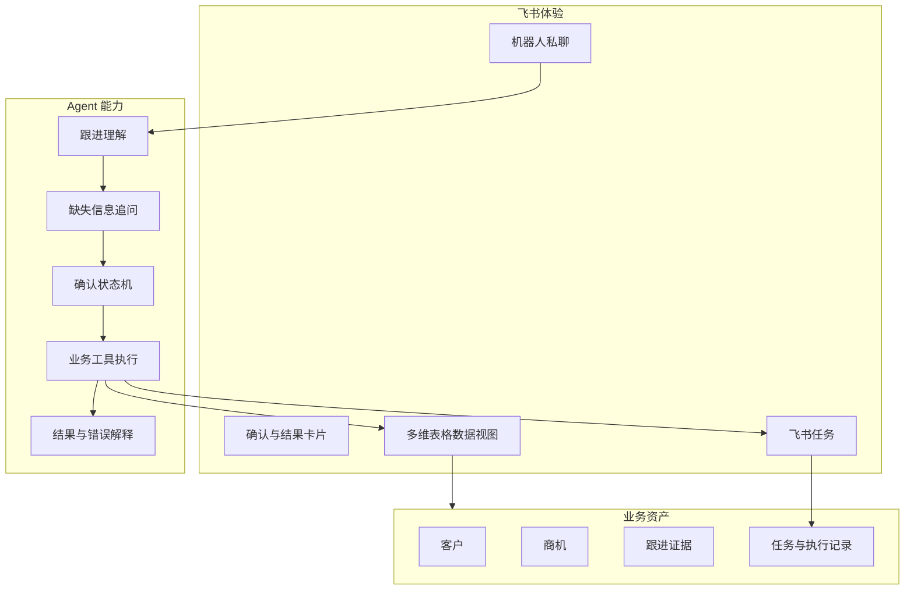

# 产品架构

> 第 1–7 节解释历史 P0 范围。Goal v3 已增设可选 Web、内容质检与项目质检等能力；
> 当前产品交互决策见第 8 节和 [决策问答](decisions/2026-09-20-followup-chat-cards.md)。
> 对话入口与保存前反馈新决策见
> [2026-09-20 问答](decisions/2026-09-20-conversation-and-quality.md)。

## 1. 产品定位

销策 Agent 是运行在飞书会话中的销售行动 Agent。它将销售人员的自然语言跟进转换为可确认
的客户事实、商机变化和下一步任务，减少重复录入，并让每个动作可以追溯到原始沟通。

P0 不是完整 CRM，也不是经营看板。它只证明一个核心价值：

```text
自然语言跟进 -> 结构化业务事实 -> 用户确认 -> 数据沉淀 -> 真实任务
```

## 2. 产品目标与 Demo 边界

| 维度 | 产品目标 | P0 Demo |
| --- | --- | --- |
| 服务对象 | 多个飞书企业 | 一个真实测试企业 |
| 租户能力 | 每企业独立配置和数据 | 代码与测试预留完整租户边界 |
| 用户入口 | 飞书内 Agent | 机器人私聊 + 消息卡片 |
| 业务数据 | 可接 CRM、数据库或 Base | 一个 Demo 多维表格 |
| 执行动作 | 多种销售工具 | 创建飞书任务 |
| 管理能力 | 配置、经营和组织学习 | 不实现独立页面 |
| 分发方式 | 商店/ISV 应用或企业独立配置 | 已有自建应用测试 |

## 3. 目标用户

| 角色 | P0 行为 | P0 价值 |
| --- | --- | --- |
| 销售人员 | 提交跟进、补充字段、确认任务 | 少填表，沟通结束后立刻形成行动 |
| 测试管理员 | 准备 Base、权限和租户配置 | 能检查 Agent 是否写入正确数据 |
| SaaS 平台 | 识别租户、选择数据源、隔离状态 | 同一套服务不会串企业数据 |

销售经理、销售运营和企业管理员的管理页面不在 P0 范围。

## 4. 产品组成



## 5. P0 功能模块

### 跟进理解

- 识别客户、联系人、沟通事实、需求、异议、风险和进展。
- 识别金额、下一步、负责人和截止时间。
- 输出固定结构，不让自由文本直接进入业务写入。

### 对话补全

- 判断客户、下一步和截止时间等执行字段是否缺失。
- 一次只询问必要信息。
- 将补充内容合并到当前租户、当前用户的会话中。

### 确认与行动

- 用卡片展示即将写入和创建的内容。
- 确认后调用 Base 与飞书任务工具。
- 取消、过期和重复点击不产生副作用。

### 多租户路由

- 根据飞书事件中的 `tenant_key` 解析租户。
- 每个租户绑定自己的凭证引用、Base 和表字段映射。
- 所有会话、待确认动作和审计记录带 `tenant_id`。

## 6. 页面策略

P0 不开发页面。Base 本身提供表格查看和人工纠错能力，飞书任务提供执行界面。

未来满足以下任一条件时再增加管理页面：

- 企业需要自行配置 CRM、数据库或 Base。
- 管理员需要配置字段映射、权限或自动动作。
- 管理者需要跨商机筛选、经营预测和团队分析。
- SaaS 需要安装管理、计费或审计查询。

## 7. 产品成功标准

- 销售可以在一次飞书对话中把非结构化跟进转成真实数据和任务。
- 每次外部写入都有明确的用户确认和审计记录。
- 结构化数据可以追溯到原始消息，而不是 AI 无依据推断。
- 重试和重复事件不会产生重复记录。
- 一个租户无法读取或操作另一个租户的数据源。

## 8. Goal v3 渠道与能力分工

| 能力 | 主要触点与时点 | 写操作边界 |
| --- | --- | --- |
| 跟进生成与实时内容质检 | 原机器人聊天的草案卡；Web 表单可即时显示完整度 | 编辑同卡新版本，未确认不写 Base |
| 下一步任务 | 草案卡预览本人任务；保存后的结果卡展示已创建任务 | 一次确认授权所示任务，先 Base 后 Task |
| 项目推进质检 | 保存后结合历史，商机详情常驻；新风险等才推送第三种卡 | AI 判断不自动改阶段/任务状态 |
| 跨角色通知 | 风险、支持请求、里程碑的条件事件 | 事实确认、明确对象、策略与权限先行 |
| 报告和任务提醒 | 定时或任务状态事件，不占单次跟进卡片序列 | 按租户时区、去重、免打扰与快照运行 |

普通跟进使用一张持续更新的卡片，条件性项目质检才追加第二张风险卡。Goal v3 的 Web 用于主动进入的表单、
历史及复杂分析；机器人来源不得被迫跳 Web 确认。详见
`docs/specs/01-information-architecture.md`、`docs/specs/phases/phase-b-sales-behavior-agent.md`。

## 9. 对话式产品分层（覆盖旧“只会写跟进”入口）

机器人首先是统一自然语言入口：所有自然语言先由 LLM 结合同聊天短期上下文分类；问候/方法
问答/内容生成直接回应；查客户、商机、任务走有权限的数据查询；记录跟进、建任务、改商机等
写动作先预览确认；歧义陈述先澄清。代码不使用关键词作为主意图路由，只在分类完成后做状态
机、安全门和已确认的内容提取。
跟进只是其中一条技能链，不能默认接管所有私聊消息。首个 B0 切片只交付单轮自然聊天、
销售方法问答、草稿、明确跟进和澄清；查询与操作未接通时如实说明，完整 Sia/RAG 后续接入。

短期上下文由 LangGraph Postgres Checkpointer 保存，按租户、用户和聊天生成隔离的 `thread_id`，
承接 thread 状态、暂停/恢复和有限上下文；活跃跟进草案继续由 `agent_sessions`/
`pending_actions` 保存，确认后的客户、商机、跟进和任务才是长期业务事实。Mem0 OSS 是长期项目
优先采用的语义记忆框架，但 P0 评测完成前不启用生产写入。

保存前只检查跟进事实和下一步是否可用；项目健康诊断在保存后基于历史证据按需出现；
销售表现辅导只在主动请求时出现。旧数字评分可留作后台兼容，不在确认卡评判销售。
