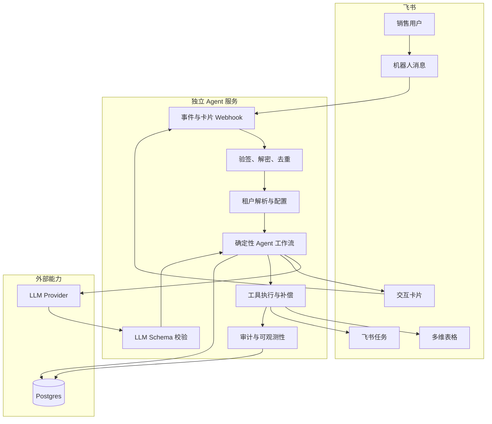

# 技术架构

> 第 1–15 节保留 P0 架构基线。Goal v3 的原聊天卡片、草案版本、任务预览、条件推送与
> 状态回收在 `docs/specs/03-system-and-data-design.md` 和 Phase B 中演进；第 16 节记录
> 2026-09-20 增量，避免把旧 P0 的确认处理器误作新版已完成。
> 对话与卡片可用性增量见第 17 节和
> [新决策](decisions/2026-09-20-conversation-and-quality.md)。
> 2026-09-23 起，Agent 运行时迁移到 LangChain.js + LangGraph.js；具体边界和迁移门禁见第 18 节
> 与 [LangGraph Agent Runtime SDD](specs/10-langgraph-agent-runtime-sdd.md)。

## 1. 架构结论

P0 使用独立部署的 NestJS Agent 后端，不依赖妙搭运行时、妙搭数据库或妙搭 AI 插件。

- 飞书开放平台负责机器人、事件、消息卡片、Base 和任务 API。
- 项目代码负责 Agent 编排、确认状态机、租户隔离、幂等、审计和失败补偿。
- LLM Provider 负责模型推理，但不能直接调用业务写工具。
- 多维表格保存 Demo 客户、商机和跟进。
- 独立 Postgres 保存租户配置、会话、待确认动作、任务映射和审计。
- P0 没有前端构建产物和独立页面。

现有 NestJS 代码可作为语言和框架基础，但必须解除对妙搭运行时的依赖后才能进入目标架构。

## 2. 目标架构



## 3. P0 运行组件

| 组件 | 责任 | 不负责 |
| --- | --- | --- |
| Feishu Event Gateway | URL challenge、验签、解密、事件归一化 | 业务推理 |
| Tenant Resolver | `tenant_key` 到内部租户和配置的映射 | 接受客户端伪造租户 |
| Conversation Service | 合并多轮补充信息和过期处理 | 永久保存无关聊天 |
| Follow-up Extractor | 调用 LLM 并验证固定 Schema | 直接写 Base |
| Confirmation Service | 冻结草案、生成卡片、校验确认人和终态 | 重新推理已冻结草案 |
| Base Adapter | 按租户配置匹配并写客户、商机、跟进 | 写死表和字段 ID |
| Feishu Task Adapter | 创建任务并保存映射 | 自动向外部联系人发消息 |
| Audit Service | 记录状态、工具结果和失败原因 | 记录 Secret 或完整 Token |

## 4. 飞书应用形态

### P0

使用已有飞书自建应用“销售agent”在其所属测试企业完成真实演示。需要配置：

- 机器人能力。
- 接收私聊消息所需事件订阅和权限。
- 发送消息卡片及接收卡片动作所需权限。
- 多维表格读取和写入权限。
- 飞书任务创建权限。
- Event Subscription 的验证 Token、Encrypt Key 和公开 HTTPS 回调地址。

App Secret 必须重置，且只能通过环境变量或密钥管理服务提供。

### 多企业生产形态

自建应用只能在所属企业内使用。面向多个企业时，需要以下一种生产分发方式：

1. 飞书商店/ISV 应用，由各企业安装并产生独立租户上下文。
2. 每个企业提供独立应用凭证，由 SaaS 管理多套应用配置。

P0 不完成应用市场发布，但事件、配置和数据模型不得假设只有一个租户。

## 5. 事件处理流程

```text
POST /webhooks/feishu/events
  -> 验证 URL challenge / 请求签名
  -> 必要时解密事件
  -> 以 tenant_key 解析内部 tenant_id
  -> 使用 tenant_id + message_id 去重
  -> 只接受允许的私聊文本事件
  -> 投递 Agent 工作流
  -> 尽快响应飞书，异步完成模型和消息发送
```

```text
POST /webhooks/feishu/cards
  -> 验签与租户解析
  -> 读取不可变 pending_action
  -> 校验 actor_open_id、tenant_id、状态和有效期
  -> 原子抢占 Executing 状态
  -> 执行 Base 与 Task 工具
  -> 写入终态并更新卡片
```

具体路由可按飞书 SDK 要求合并，但安全和业务处理必须保持逻辑分层。

## 6. Agent 工作流

P0 不使用开放式无限循环 Agent。采用可测试的确定性状态机：

```text
COLLECTING
  -> EXTRACTING
  -> NEEDS_CLARIFICATION | PENDING_CONFIRMATION
  -> CANCELLED | EXECUTING | EXPIRED
  -> SUCCEEDED | PARTIAL_FAILURE | FAILED
```

允许 LLM 的步骤只有：

- 将用户原话转换为结构化跟进草案。
- 将补充回答合并到已有草案。
- 生成面向用户的简短说明。

客户匹配、字段完整度、租户路由、状态迁移、幂等和工具执行均由确定性代码控制。

## 7. LLM 契约

建议使用可替换的 OpenAI-compatible Provider 接口，模型和 Base URL 通过环境变量配置。

结构化输出示意：

```typescript
type FollowupDraft = {
  customerName: string | null;
  contactName: string | null;
  opportunityName: string | null;
  summary: string;
  customerNeeds: string[];
  objections: string[];
  risks: string[];
  progress: string | null;
  expectedAmount: number | null;
  nextAction: string | null;
  dueAt: string | null;
  evidenceQuotes: string[];
};
```

服务端使用 Zod 或等价 Schema 校验：

- 字段类型不合法时拒绝进入确认状态。
- 金额和时间通过确定性解析再次检查。
- `evidenceQuotes` 必须能在用户输入中找到。
- 关键字段缺失时生成追问，不允许模型凭空补齐。
- Prompt 版本和模型名称进入审计记录，API Key 不进入记录。

## 8. Base 数据适配

每个租户的数据源配置至少包含：

```text
tenant_id
base_token_reference
customer_table_id
opportunity_table_id
followup_table_id
field_mapping
enabled
```

Base Adapter 对上层暴露领域工具：

```typescript
findCustomerByName()
createCustomer()
findOpenOpportunities()
createOrUpdateOpportunity()
createFollowup()
```

领域工作流只认识标准字段，不认识具体中文列名或飞书字段 ID。适配器必须先读取并校验真实
Base Schema，再启用租户配置。

P0 通过用户身份创建 Demo Base；运行时优先使用租户范围的应用身份访问，并确保该应用已获得
Base 资源权限。若相关 API 必须使用用户授权，则增加最小 OAuth 授权，不在代码中模拟用户。

## 9. 内部数据模型

P0 独立数据库只保存控制数据，不复制全部业务数据。

| 表 | 关键字段 |
| --- | --- |
| `tenants` | `id`, `feishu_tenant_key`, `status` |
| `tenant_integrations` | `tenant_id`, 凭证引用、Base 配置、字段映射 |
| `agent_sessions` | `tenant_id`, `actor_open_id`, 状态、草案、过期时间 |
| `pending_actions` | `tenant_id`, 不可变 payload、确认人、状态、幂等键 |
| `task_mappings` | `tenant_id`, followup record ID、task GUID |
| `audit_events` | `tenant_id`, trace ID、事件类型、结果摘要、时间 |

所有唯一键和外键关系必须包含或可追溯到 `tenant_id`。Repository API 不提供无租户查询。

## 10. 凭证与环境变量

仅记录变量名，不在仓库提供真实值：

```text
FEISHU_APP_ID
FEISHU_APP_SECRET
FEISHU_VERIFICATION_TOKEN
FEISHU_ENCRYPT_KEY
LLM_BASE_URL
LLM_API_KEY
LLM_MODEL
DATABASE_URL
PUBLIC_BASE_URL
```

要求：

- 本地值进入被 Git 忽略的环境文件或系统密钥存储。
- 生产值进入托管平台的 Secret Manager。
- 日志对 Header、Token、Secret 和客户敏感原文做脱敏。
- Secret 轮换不要求修改代码或重新构建镜像。

## 11. 幂等与补偿

| 场景 | 幂等键 | 处理 |
| --- | --- | --- |
| 飞书重复消息事件 | `tenant_id + message_id` | 已处理则直接返回 |
| 卡片重复点击 | `tenant_id + pending_action_id` | 只有一次能进入 Executing |
| 客户创建 | `tenant_id + normalized_customer_name` | 先查询，冲突时停止 |
| 跟进创建 | `tenant_id + source_event_id` | 已存在则复用记录 |
| 任务创建 | `tenant_id + pending_action_id + task` | 先检查 task mapping |

外部调用结果必须逐步持久化。发生部分失败时，从最后一个已确认成功的步骤继续，不重放整个流程。

## 12. 目录建议

文档确认后再实施以下最小结构：

```text
server/
  modules/
    feishu-gateway/
    tenant/
    agent/
    integrations/
      base/
      task/
    audit/
  common/
    config/
    database/
    security/
  main.ts
tests/
  unit/
  integration/
  tenant-isolation/
```

现有 `client/` 不参与 P0 构建。遗留妙搭文件的删除或迁移需单独审阅。

## 13. 本地开发与部署

```text
飞书测试企业
  -> 公网 HTTPS 回调或安全开发隧道
  -> 本地/测试环境 NestJS
  -> 测试 Postgres
  -> Demo Base + 飞书任务
```

P0 发布到任意能够提供稳定 HTTPS、环境变量和 Postgres 的托管平台即可。平台选择不属于当前
文档决策；先保证代码不依赖某个托管商专有运行时。

## 14. 测试与验收

### 自动化

- FollowupDraft Schema 与字段完整度测试。
- 状态机合法迁移和过期测试。
- 重复事件、重复确认和部分失败补偿测试。
- Base 与 Task Adapter 契约测试。
- 两个模拟租户的配置、会话、动作和幂等隔离测试。
- Secret 与跨租户字段不得出现在日志的测试。

### 真实飞书

- URL challenge 和加密事件验证通过。
- 真实私聊触发 Agent。
- 真实确认卡片可执行和更新。
- 真实 Base 三表写入正确。
- 真实飞书任务创建成功。
- 取消、无权限和至少一个失败场景可见。

## 15. 集成阶段阻塞条件

出现以下任一情况且替代路径验证失败时停止，不继续猜测：

- 没有重置后的 App Secret 或必要飞书权限。
- 没有可访问的 HTTPS 回调地址。
- 没有可用 LLM 模型凭证。
- 自建应用身份无法访问 Demo Base，且用户 OAuth 也无法授权。
- Task API 无法以应用或授权用户身份创建任务。

停止时必须报告已尝试路径、飞书错误码、缺失权限或配置，以及唯一需要用户完成的动作。

## 16. Goal v3 卡片编排增量

```text
input job (tenant + actor + source chat)
  -> append-only draft version
  -> deterministic content review
  -> task candidates derived from the same exact version
  -> render/update draft card in source chat
  -> confirm(version + selectedTaskCandidateIds)
  -> lease execution once
  -> persist customer/opportunity/followup
  -> create only the selected, authorized tasks
  -> send result card to source chat
  -> enqueue project review and policy notifications
```

工程约束：

- 输入作业保存来源聊天 ID 和卡片消息 ID；所有补充、更新和结果路由回该聊天。卡片回调必须
  校验租户、提交人、消息/卡片归属、草案版本、有效期与幂等键。
- `followup_draft_versions` 只追加；保存前质量快照、证据和任务候选绑定精确版本。编辑或
  重新生成后旧确认失效，不能把旧卡的任务预览应用到新正文。
- 确认负载只携带服务器签发的草案/候选引用，不信任客户端提交的 tenant、actor、任务负责人
  或任意业务字段。本人任务可一次确认；他人负责人须经过授权服务并使用额外确认上下文。
- 执行器按步骤持久化 Base record ID 与 Task GUID。跟进未保存不得建任务；任务部分失败时
  outbox 只重试缺失任务。卡片更新失败不回滚业务终态，但必须可重新查询并补发。
- 保存后项目质检、跨角色推送、报告和提醒使用独立事件消费者和 outbox；资源授权在发送时
  重新检查。AI 任务状态判断写建议事件，用户确认后才调用 Task 更新接口。
- 飞书 Card 2.0 不提供按键级服务器检查：表单提交/检查回调后异步更新整张卡。Web 可即时
  计算确定性完整度；确认时以服务端同版本的阻断项、建议与内部兼容快照为准。

## 17. 对话路由与保存前可用性增量

```text
Feishu message
  -> tenant / actor / chat / message dedupe
  -> short-term memory read + versioned LLM intent classifier
  -> state-machine safety gate
  -> chat reply | clarification | authorized query | operation preview
  -> classified followup_capture enters FollowupExtractor
```

- 意图分类器只返回受 Schema 约束的意图、置信度和建议回复，不具有工具权限。自然语言主路由由
  LLM 完成；代码中的显式命令解析只在意图已经分类后负责提取跟进正文或打开空白录入表单，
  不能单独触发工具。低置信或 Schema 错误保守澄清/失败。
- 普通聊天、方法问答和内容草稿也写入租户/用户/聊天隔离的短期对话记忆，但不写客户、商机、
  跟进或任务。查询未接通时返回真实边界；后续数据问答必须复用授权与数据源端口。
- 跟进补充会话需增加 chat 归属检查；普通问答和换话题不能污染 `rawText`。
- `QualityAssessment` 旧数字字段暂保留以兼容历史草案和测试。Card renderer 改为推导
  `ready / needs_confirmation / suggestions`，默认不渲染分数和等级；Web 旧详情仍可回读快照。

## 18. LangChain/LangGraph 运行时与记忆分层增量（2026-09-23）

### 18.1 组件职责

| 组件 | 目标职责 | 迁移约束 |
| --- | --- | --- |
| LangChain.js | GLM/OpenAI-compatible 模型适配、提示词、structured output | 模型只能产生结构化建议，不能直接调用业务工具 |
| LangGraph.js | 唯一生产对话编排、状态图、interrupt/resume 和节点可观测性 | 替换当前自研主路由，不与旧路由长期并行 |
| LangGraph Postgres Checkpointer | thread 状态、短期上下文、暂停/恢复和状态快照 | 替换 `MemoryControlStore` 短期主路径，不承担长期语义记忆 |
| Mem0 OSS | 受策略控制的长期用户/销售语义记忆 | 经过 ACL、来源、删除和评测；不作为业务事实源 |
| Base / Feishu Task / 控制库 | 客户、商机、跟进、任务、授权、审计事实 | 保留现有适配器、确认门和幂等 |

### 18.2 Graph 主链路

```text
Feishu Webhook
  -> tenant / actor / chat / dedupe
  -> LangGraph StateGraph(thread_id)
  -> context(Checkpointer + ACL filtered Mem0)
  -> classifyIntent(LangChain structured output)
  -> routeIntent(deterministic safety gate)
  -> chat | clarify | followup extract | confirmation interrupt
  -> Base/Task tools after confirmation
  -> Checkpointer state + audit
```

`thread_id` 使用 `tenantId:actorOpenId:chatId`，所有恢复、记忆召回和工具调用都重新校验租户、
用户、聊天、草案版本、TTL 和权限。Mem0 写入只在业务动作成功且策略允许后异步进行，失败不
回滚业务事实，也不阻塞结果卡。

### 18.3 Mem0 适配层当前实现

长期语义记忆通过 `LongTermMemoryPort` 隔离 Mem0 OSS 细节。`Mem0MemoryAdapter` 当前默认关闭，
只有在 `MEM0_ENABLED=true` 且持久向量后端、embedding 和 LLM 配置齐全时才初始化。适配器使用
`sales-agent-long-term:{tenantId}:{actorOpenId}` 作为 Mem0 `user_id`，metadata 保存租户、销售、
客户引用、来源和策略版本，并在返回结果前执行二次 scope 校验。P0 尚不从 Graph 读取 Mem0，
也不在跟进确认流程中自动写入；这两个动作必须等 TDD 评测和异步失败降级完成后再单独启用。

### 18.4 迁移和回滚

先锁版本和状态契约，再写 Red 测试、替换意图路由、迁移 Checkpointer、评测 Mem0，最后删除旧
生产入口。迁移期间允许只读回放旧状态用于对账，但禁止旧/新实现长期双写双读；任一门禁未过时
回滚到上一已验证 Graph 构建，而不是用第二套运行时掩盖问题。
